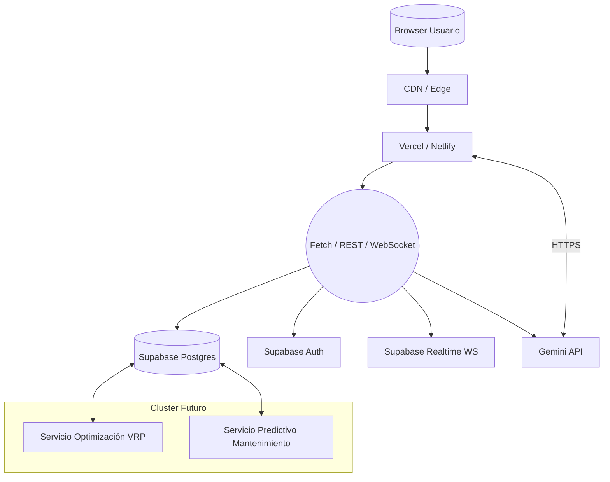
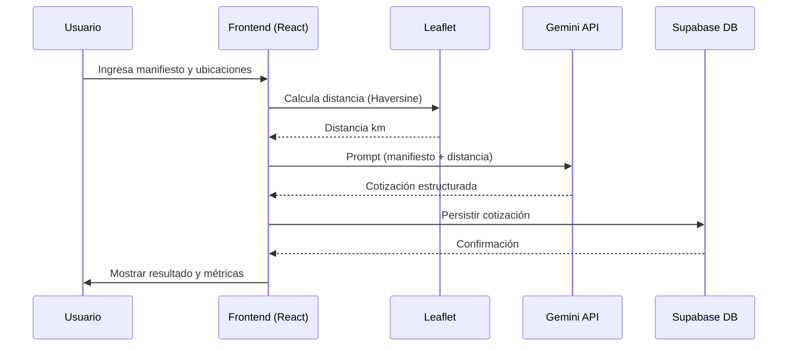
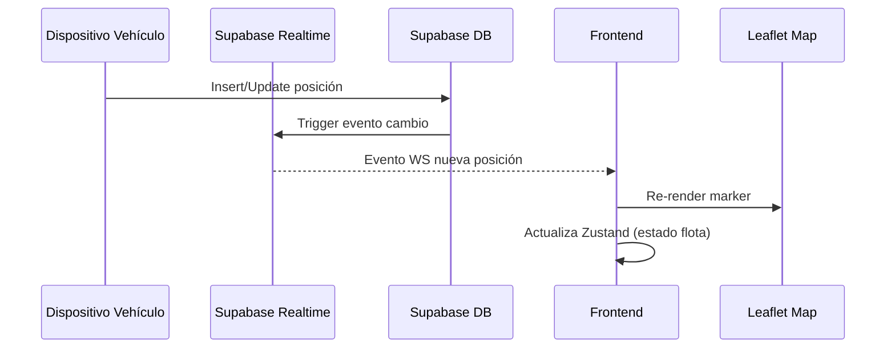
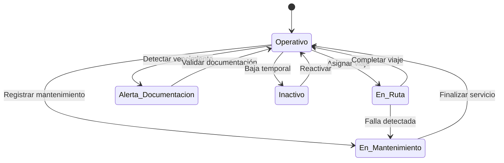
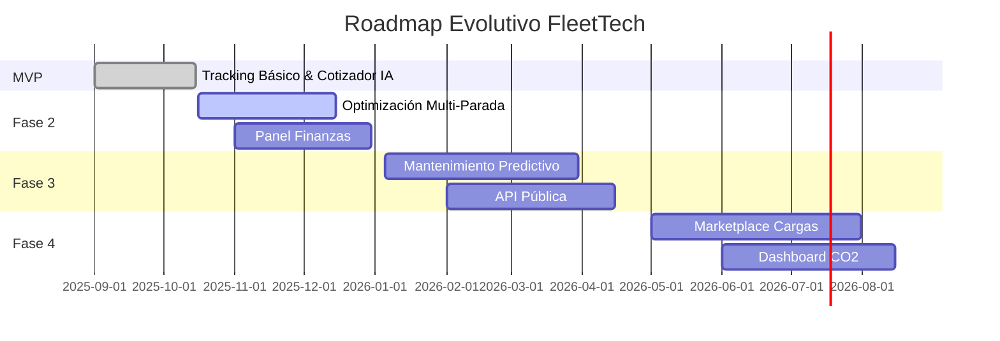
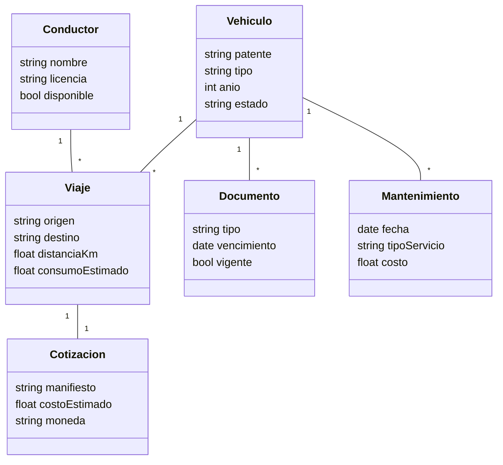
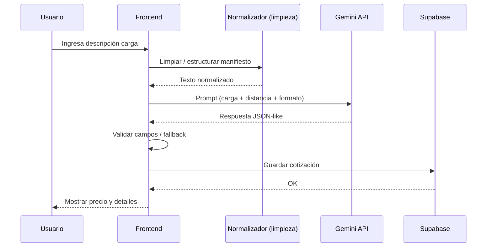
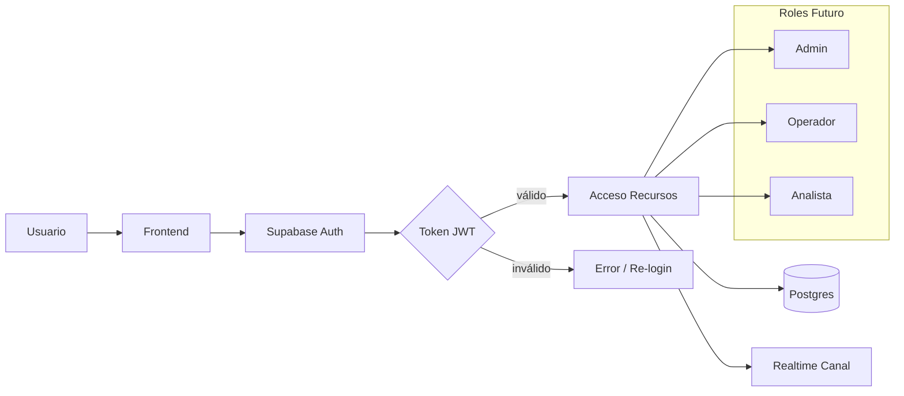
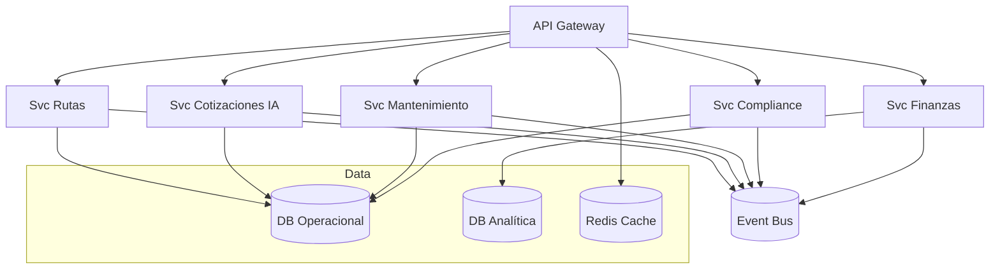

# FleetTech – Prompts y Diagramas de Arquitectura (Mermaid)

Este documento incluye:
- Prompts listos para pedir a un modelo/IA que genere o refine diagramas.
- Ejemplos base en **Mermaid** que puedes adaptar.
- Variantes: arquitectura lógica, física, flujo de datos, secuencias, estado y roadmap evolutivo.

## 1. Prompt General de Arquitectura Lógica
```
Genera un diagrama Mermaid que muestre la arquitectura lógica de FleetTech.
Incluye: Usuario Web, Frontend (React + Vite), Estado (Zustand), Servicios (Supabase: Auth, DB, Realtime), Servicio IA (Gemini API), Mapa (Leaflet/OpenStreetMap), Gestión de Rutas, Módulo Compliance, Módulo Finanzas y Futuro: Motor de Optimización y Mantenimiento Predictivo. Agrupa por capas: Presentación, Lógica, Datos, IA/Servicios Externos.
```

```mermaid
flowchart LR
  subgraph Presentacion[Presentación]
    U[Usuario Navegador]
    FE[React + Vite SPA]
    ST[Zustand Store]
  end
  subgraph Logica[Capas de Dominio]
    RP[RoutePlanner]
    TR[FleetTracking]
    CP[Compliance]
    FN[Financials]
    AIQ[AIQuote]
  end
  subgraph Datos[Persistencia / Realtime]
    SB[(Supabase DB)]
    AUTH[[Auth Service]]
    RT[(Realtime Canal)]
  end
  subgraph Externo[Servicios Externos]
    GM[Gemini API]
    MAP[Leaflet / OSM]
    FUT1[Optimizador VRP (roadmap)]
    FUT2[Mantenimiento Predictivo (roadmap)]
  end

  U --> FE --> ST
  ST --> RP & TR & CP & FN & AIQ
  RP --> MAP
  AIQ --> GM
  TR --> RT
  CP --> SB
  FN --> SB
  RP --> SB
  SB --> AUTH
  ST --> RT
  FUT1 --> RP
  FUT2 --> CP
```

## 2. Prompt de Arquitectura Física / Despliegue
```
Genera un diagrama Mermaid de despliegue para FleetTech: Cliente Web (Browser), CDN, Hosting (Vercel/Netlify), Supabase (Postgres + Auth + Realtime), API Gemini, Futuro cluster Docker/Kubernetes para microservicios de optimización y mantenimiento. Muestra conexiones seguras HTTPS y direcciones lógicas.
```



## 3. Prompt Flujo de Datos Principal
```
Genera un diagrama Mermaid que represente el flujo de datos cuando un usuario crea una cotización de ruta: Usuario escribe manifiesto + origen/destino -> Frontend calcula distancia -> Envía prompt a Gemini -> Recibe respuesta estructurada -> Guarda resumen en Supabase -> Actualiza vista AIQuote y Financials.
```



## 4. Prompt Secuencia Tracking en Tiempo Real
```
Genera un diagrama Mermaid de secuencia para el tracking: Conductor actualiza posición -> Supabase Realtime emite evento -> Frontend suscrito actualiza mapa Leaflet -> Estado almacena última posición y recalcula panel resumen.
```



## 5. Prompt Diagrama de Estados Simplificado
```
Genera un diagrama de estados Mermaid para un vehículo: Operativo, En Ruta, En Mantenimiento, Inactivo, Alerta Documentación. Transiciones: Asignar viaje, Completar viaje, Registrar mantenimiento, Detectar vencimiento, Validar documentación.
```



## 6. Prompt Roadmap Evolutivo (Release Plan)
```
Genera diagrama Mermaid mostrando roadmap por fases: MVP (Tracking básico, Cotizador IA), Fase 2 (Optimización rutas multi-parada, Panel Finanzas), Fase 3 (Mantenimiento predictivo, API pública), Fase 4 (Marketplace y CO2 Dashboard).
```



## 7. Prompt Diagrama Entidad-Relación Simplificado
```
Genera un diagrama Mermaid (classDiagram) mostrando entidades: Vehiculo, Conductor, Viaje, Documento, Cotizacion, Mantenimiento. Relaciones: Vehiculo 1..* Viaje, Conductor 1..* Viaje, Vehiculo 1..* Documento, Vehiculo 1..* Mantenimiento, Viaje 1..1 Cotizacion.
```



## 8. Prompt Interacción IA (Secuencia Prompting)
```
Genera diagrama de secuencia Mermaid para flujo de cotización IA: Usuario -> Frontend -> Normaliza texto -> Construye prompt -> Gemini -> Postprocesa respuesta -> Guarda en Supabase -> Actualiza UI.
```



## 9. Prompt Seguridad / Acceso
```
Genera diagrama Mermaid de flujo de autenticación: Usuario -> Frontend -> Supabase Auth -> Token -> Acceso autorizado a DB y Realtime. Incluir control de roles futuro (ADMIN, OPERADOR, ANALISTA).
```



## 10. Prompt Para Adaptar a Microservicios
```
Genera un diagrama Mermaid que muestre transición futura a microservicios: Servicio Frontend, Servicio Rutas, Servicio Mantenimiento, Servicio Cotizaciones IA, Servicio Compliance, API Gateway, Base de Datos compartida vs bases específicas, Bus de Eventos.
```



---
### Consejos para Refinar Prompts
1. Añade métricas o KPIs concretos al pedir detalle (ej: latencia, reducción de costos).  
2. Especifica si quieres colores o estilos avanzados (Mermaid supports classDef).  
3. Indica si el diagrama debe ocultar elementos futuros (para presentaciones MVP).  
4. Solicita versiones alternativas: "Genera una versión mínima sin componentes futuros".  
5. Para iteraciones: "Refina el diagrama resaltando comunicaciones asíncronas y canales WebSocket".

### Ejemplo Prompt Iterativo
```
Refina el diagrama de flujo de cotización agregando manejo de errores (timeout Gemini) y fallback a tarifa base histórica si la respuesta falla.
```

---
Si necesitas que genere más variantes (p.ej. clases CSS Mermaid o versiones en inglés), pídelo directamente.
